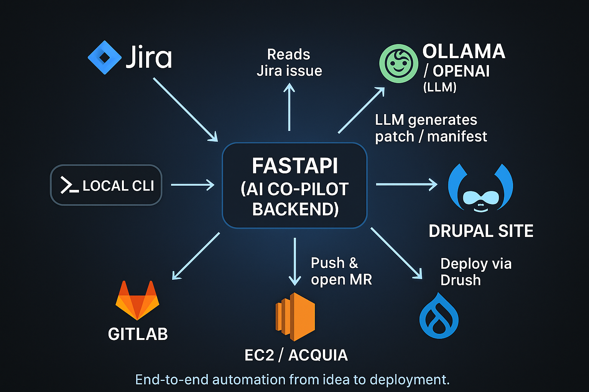

[//]: # (<p align="center">)

[//]: # (  <!-- Status / meta -->)

[//]: # (  <a href="https://github.com/ovanesb/drupal-devops-copilot/releases">)

[//]: # (    )

[//]: # (  </a>)

[//]: # (  <a href="LICENSE">)

[//]: # (    )

[//]: # (  </a>)

[//]: # (  <a href="https://github.com/ovanesb/drupal-devops-copilot/commit/main">)

[//]: # (    )

[//]: # (  </a>)

[//]: # (  <a href="https://github.com/ovanesb/drupal-devops-copilot/stargazers">)

[//]: # (    )

[//]: # (  </a>)

[//]: # (</p>)

<p align="center">
  <!-- Stack -->
  
  
  
  
  
  
  
  
</p>

<p align="center"> 
    <a href="https://github.com/ovanesb/drupal-devops-copilot/discussions"> 
         
    </a> 
    <a href="https://github.com/ovanesb/drupal-devops-copilot/issues"> 
         
    </a> 
    <a href="docs/CONTRIBUTING.md"> 
         
    </a> 
</p>

---

# 🧠 Drupal DevOps Co-Pilot

> **An open-source AI assistant** that automates the full Drupal DevOps lifecycle — from Jira issue to GitLab merge request to EC2 deployment and QA.

**AI-powered agent that plans, writes, commits, opens MRs, runs Drush QA, and deploys Drupal changes.**  <br /><br />
Built with **FastAPI**, **GitLab CI**, **Jira API**, and local or cloud LLMs like **Ollama (Qwen2.5-Coder)** or **OpenAI-compatible endpoints**.


---
## ✨ Features
- **Reads context**: Jira ticket + repo scan + guardrails
- **Generates code**: unified diff or JSON file manifest (for scaffolds)
- **Sanitizes safely**: fixes JSON escapes, unescapes PHP `$vars`, removes rogue `declare(strict_types)`
- **Commits & pushes**: clean messages, opens Merge Request automatically
- **Runs QA**: Drush (`cr`, `pm:install`, etc.) on EC2 or your target host
- **Reports back**: comments/updates to MR and Jira (optional)

> [!NOTE]
> 
> From ticket → deployment in minutes, consistently.

---
## 🧱 Architecture (High-level)
- **Agent Brain (Python)** → prompt builder → LLM call → patch/manifest → sanitizers → Git ops
- **LLM Runtime** → Ollama (local) or any OpenAI-compatible `/v1` endpoint
- **Integrations** → GitLab (MRs), Jira (optional), EC2/remote host (Drush QA & deploy)

**System Architecture:** <br />
_End-to-end automation from Jira → GitLab → EC2 using FastAPI and Ollama._
<p align="center">
  
</p>

---
## 🛠️ Requirements
- **OS**: macOS or Linux (Apple Silicon & Intel both OK)
- **Python**: 3.10+
- **Git**: 2.30+
- **Ollama** (for local LLM) or an OpenAI-compatible endpoint
- **GitLab repo** (personal access token if creating MRs via API)
- **Drupal project** to operate on (monorepo or separate checked out under `work/`)

---
## 📎 TL;DR

```bash
# Install deps
python3 -m venv .venv && source .venv/bin/activate
pip install -r requirements.txt
ollama pull qwen2.5-coder:14b-instruct-q4_K_M

# Configure .env (see above), clone your Drupal repo to work/drupal-project

# Run
copilot-one-shot CCS-128
# or
copilot-workflow CCS-128 && copilot-ai-review-merge "<MR_URL>" --auto-merge --deploy
```

If you get stuck or want to propose an agent skill, open an issue — or ping me.

---
## 🛣️ Roadmap & ideas for v2+
| Feature | Status |
|----------|--------|
| Multi-agent orchestration | 🚧 In progress |
| DeepSeek/StarCoder LLMs | 🧩 Planned |
| Plugin system | 🧠 Concept |
| Web UI dashboard | 🧭 Beta |
| Provider auto-benchmarking | 💡 Idea |

---
## 🛡️ Reliability
- Strict path guardrails (`web/modules/custom/`)
- JSON repair for invalid escapes (`\Drupal`, `$vars`)
- PHP sanitizer removes `declare(strict_types)` and rogue `define()`
- Retry logic for Ollama timeouts
- Fallback to manifest mode if patch fails

---
## 🤝 Contributing
We welcome ideas and pull requests!  
See [CONTRIBUTING.md](docs/CONTRIBUTING.md) for guidelines.

## 🧭 Code of Conduct
Please review our [CODE_OF_CONDUCT.md](docs/CODE_OF_CONDUCT.md).  
We aim for a respectful, inclusive, and helpful space for all contributors.

---
## 📚 Documentation

- 🚀 [Quickstart (local)](docs/quickstart.md)  
  *Clone, setup venv, install deps, configure .env, run smoke test.*

- 🖥️ [Local LLM (Ollama) tips](docs/ollama-tips.md)  
  *Installation, model management, tuning parameters, and troubleshooting.*

- 🛠️ [Configuration Guide](docs/configuration.md)  
  *Environment variables, LLM providers, and GitLab/Jira setup.*

- 🧰 [CLI reference](docs/cli-reference.md)  
  *Available commands, flags, and usage examples.*

- 📊 [Architecture Overview](docs/architecture.md)  
  *High-level components, data flow, and integrations.*

- ⚙️ [Flow Overview](docs/flow-overview.md)  
  *End-to-end pipeline: Auto-Dev → AI Review → Deploy → QA Verify.*

- 💻 [Working in a New Terminal Session](docs/dev-setup.md)  
  *How to activate the environment, run backend/frontend locally, and test commands.*

- 🔧 Having issues? See [Troubleshooting Guide](docs/troubleshooting.md)  
  *Common issues, debugging tips, and FAQs.*

- 🛡️ [Security Policy](docs/SECURITY.md)  
  *Responsible disclosure process, supported versions, and scope.*

- 📄 [Contributing Guide](docs/CONTRIBUTING.md)  
  *How to contribute, commit message conventions, and project goals.*

---
## 🙌 Acknowledgements
Powered by the open-source communities behind **Drupal**, **FastAPI**, and **Ollama**.  

---
### 💬 Questions or ideas?  
Join the discussion on [GitHub Discussions](https://github.com/ovanesb/drupal-devops-copilot/discussions) —  
we’d love to hear from contributors, Drupal engineers, and AI enthusiasts!
